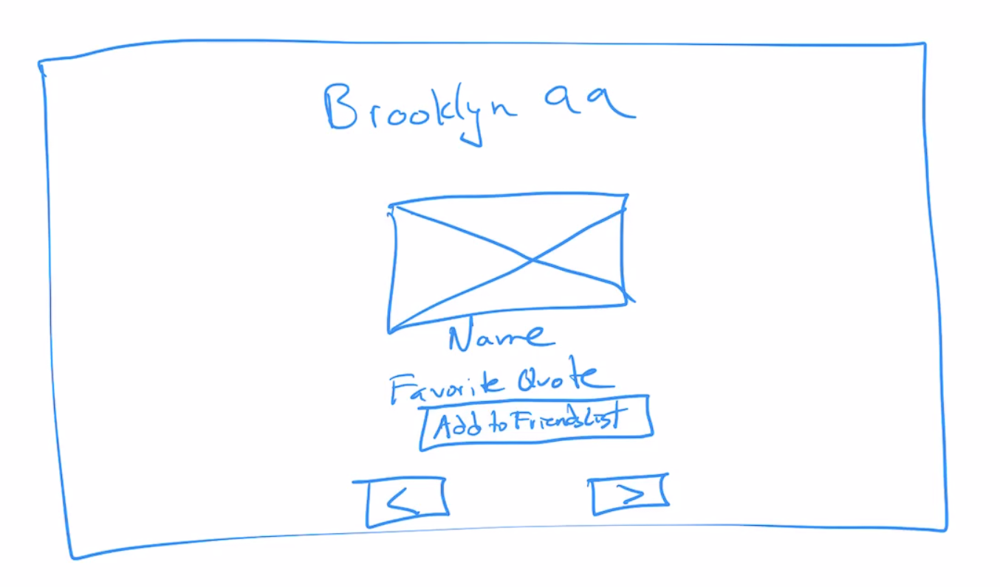

# brooklyn-99-yearbook

## Get Started

### Create the GitHub Repo

1. Create a new repo
2. Initialize with README
3. Clone to folder
4. CD into repository
5. Open with Visual Studio Code

### Sketch out what the app should like

### Create Initial Files

1. Create index.html - test with "Hello World"
2. 

## Troubleshooting

1. Compare non-working code with working code from a different project or activity.
2. Console.log everything, something? 
